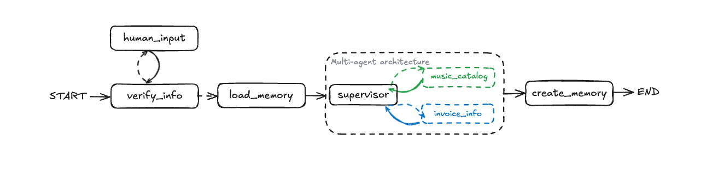
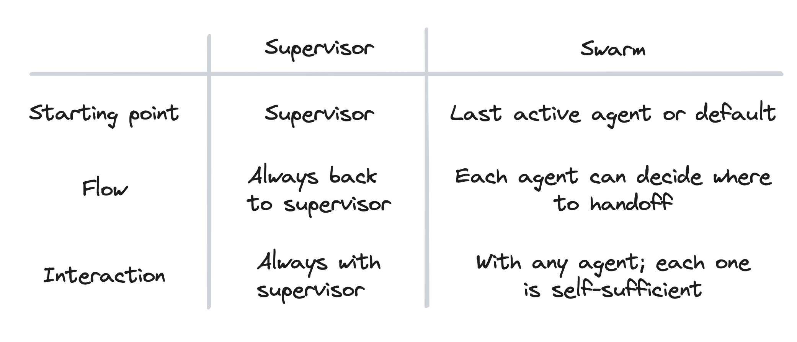
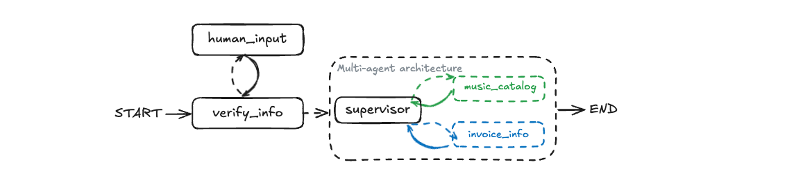
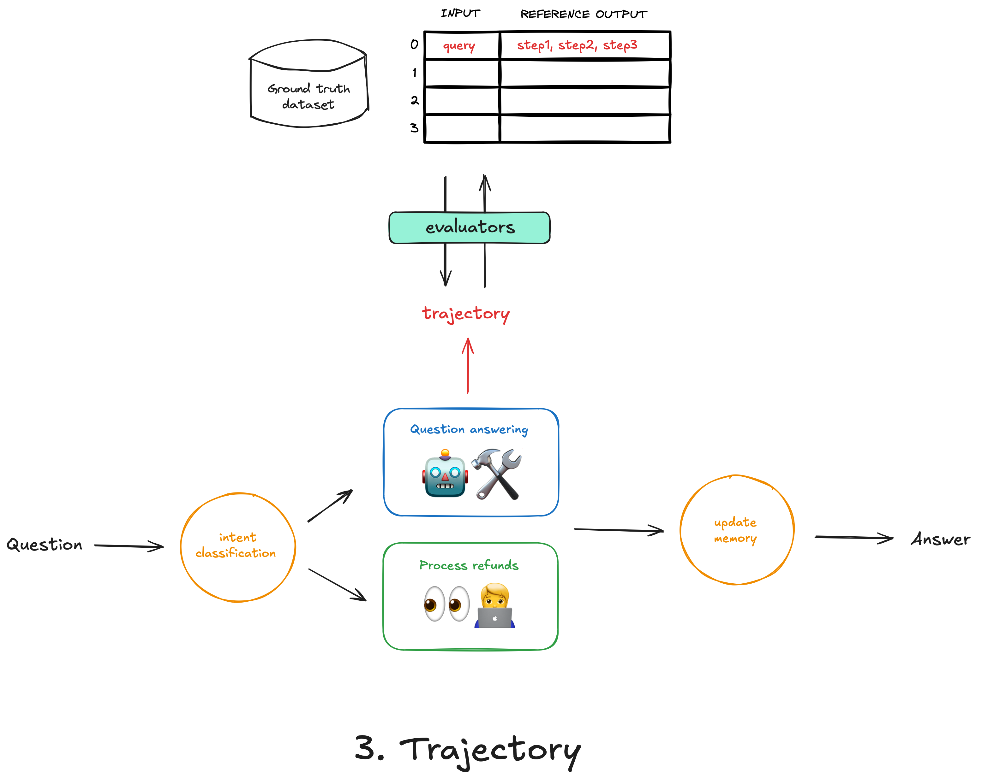
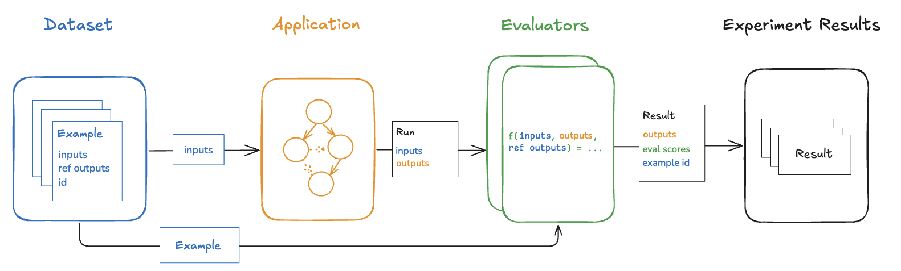
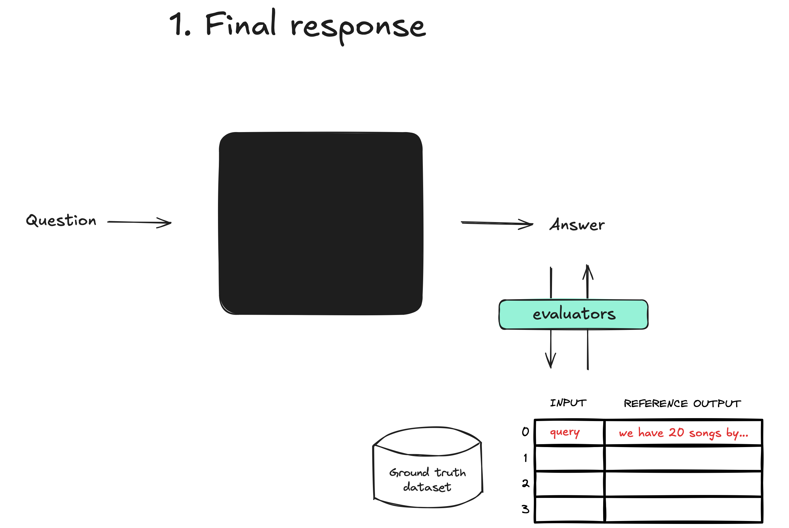

<!-- omit in toc -->
# 多智能体AI系统

[](https://www.python.org/downloads/release/python-3100/) [](https://langchain-ai.github.io/langgraph/) [](https://www.langchain.com/langsmith) [](https://www.together.ai/) [](https://openai.com/) [](https://www.sqlite.org/) [](https://medium.com/@fareedkhandev/building-a-multi-agent-ai-system-with-langgraph-and-langsmith-6cb70487cd81)

这是一个使用 **LangGraph** 和 **LangSmith** 构建的综合多智能体AI系统。该项目演示了如何创建一个复杂的客户支持智能体，该智能体使用多个专门的子智能体来处理不同类型的查询，同时集成了人机交互循环、长期记忆和评估功能。

## 🌟 主要特性

- **多智能体架构**：使用监督者模式协调专门的子智能体
- **人机交互循环**：智能客户验证和信息收集
- **双重记忆系统**：短期（对话内）和长期（跨会话）记忆
- **智能路由**：基于查询内容的动态智能体选择
- **综合评估**：使用LangSmith进行性能监控和评估
- **真实数据集**：使用Chinook数据库进行音乐商店客户支持

## 🏗️ 系统架构

我们的多智能体系统遵循监督者架构模式，其中一个中央监督智能体协调两个专门的子智能体：

1. **音乐目录子智能体**：处理音乐相关查询（艺术家、专辑、曲目、流派）
2. **发票信息子智能体**：处理账单和购买历史查询


工作流程包括：
1. **human_input**：用户提供账户信息
2. **verify_info**：系统检查账户并澄清用户意图
3. **load_memory**：检索用户的音乐偏好
4. **supervisor**：协调两个子智能体
5. **create_memory**：用交互中的新信息更新用户记忆

<!-- omit in toc -->
## 🚀 快速开始

### 仓库结构

```
Multi-Agent-AI-System/
├── .env                    # API密钥的环境变量
├── README.md               # 项目文档（英文）
├── README_CN.md            # 项目文档（中文）
├── requirements.txt        # Python依赖项
├── multi_agent.ipynb       # 多智能体AI系统的Jupyter笔记本
├── utils.py                # 项目的实用函数
├── 项目流程与核心思想.md    # 项目架构和核心概念说明
└── LICENSE                 # 项目许可证信息（MIT许可证）
```

### 安装要求

- **Python 3.10+**
- **OpenAI API密钥**
- **LangSmith API密钥**（可选，用于跟踪和评估）
- **Together AI API密钥**（可选，用于嵌入）

### 安装步骤

1. **克隆仓库**
```bash
git clone https://github.com/FareedKhan-dev/Multi-Agent-AI-System.git
cd Multi-Agent-AI-System
```

2. **安装依赖项**
```bash
pip install -r requirements.txt
```

3. **设置环境变量**
创建 `.env` 文件并添加您的API密钥：
```bash
# OpenAI API密钥（必需）
OPENAI_API_KEY=your_openai_api_key_here

# LangSmith API密钥（可选，用于跟踪）
LANGCHAIN_API_KEY=your_langsmith_api_key_here
LANGCHAIN_TRACING_V2=true
LANGCHAIN_PROJECT="Multi-Agent-System"

# Together AI API密钥（可选，用于嵌入）
TOGETHER_API_KEY=your_together_api_key_here
```

4. **运行Jupyter笔记本**
```bash
jupyter notebook multi_agent.ipynb
```

---

<!-- omit in toc -->
## 📑 目录

- [🌟 主要特性](#-主要特性)
- [🏗️ 系统架构](#️-系统架构)
- [🚀 快速开始](#-快速开始)
  - [仓库结构](#仓库结构)
  - [安装要求](#安装要求)
  - [安装步骤](#安装步骤)
- [🔧 设置环境](#-设置环境)
- [📊 LangSmith的目的](#-langsmith的目的)
- [💾 选择我们的数据集](#-选择我们的数据集)
- [🧠 记忆系统](#-记忆系统)
  - [短期记忆](#短期记忆)
  - [长期记忆](#长期记忆)
- [🏛️ 架构模式](#️-架构模式)
  - [监督者 vs 群体](#监督者-vs-群体)
  - [我们的架构选择](#我们的架构选择)
- [🔨 构建多智能体系统](#-构建多智能体系统)
  - [定义状态](#定义状态)
  - [定义工具](#定义工具)
  - [创建子智能体](#创建子智能体)
  - [实现人机交互循环](#实现人机交互循环)
  - [集成长期记忆](#集成长期记忆)
  - [构建监督智能体](#构建监督智能体)
  - [编译完整图](#编译完整图)
- [🧪 测试系统](#-测试系统)
  - [示例1：音乐查询](#示例1音乐查询)
  - [示例2：发票查询](#示例2发票查询)
  - [示例3：复合查询](#示例3复合查询)
- [📈 评估与监控](#-评估与监控)
  - [创建评估数据集](#创建评估数据集)
  - [定义评估指标](#定义评估指标)
  - [运行评估实验](#运行评估实验)
  - [分析结果](#分析结果)
- [🔍 结论与未来工作](#-结论与未来工作)
- [📄 许可证](#-许可证)

---

## 🔧 设置环境

在构建多智能体系统之前，我们需要设置适当的环境。这包括配置API密钥、安装依赖项和准备开发环境。

### 环境变量配置

创建一个 `.env` 文件并添加以下变量：

```bash
# OpenAI API密钥（用于LLM交互）
OPENAI_API_KEY=your_openai_api_key_here

# LangSmith API密钥（用于跟踪和监控）
LANGCHAIN_API_KEY=your_langsmith_api_key_here
LANGCHAIN_TRACING_V2=true
LANGCHAIN_PROJECT="Multi-Agent-System"

# Together AI API密钥（用于嵌入）
TOGETHER_API_KEY=your_together_api_key_here
```

### 初始化语言模型

我们使用OpenAI的GPT模型作为我们系统的基础LLM：

```python
import os
from dotenv import load_dotenv
from langchain_openai import ChatOpenAI

# 加载环境变量
load_dotenv()

# 初始化ChatOpenAI模型
llm = ChatOpenAI(
    model="gpt-4-turbo",  # 或者您选择的其他模型
    temperature=0,        # 设置为0以获得确定性输出
    streaming=True        # 启用流式响应
)
```

### 设置嵌入模型

对于检索和语义搜索，我们使用Together AI的嵌入模型：

```python
from langchain_community.embeddings import TogetherEmbeddings

# 初始化嵌入模型
embedding_model = TogetherEmbeddings(
    model="togethercomputer/m2-bert-80M-8k-retrieval",
    together_api_key=os.environ["TOGETHER_API_KEY"]
)
```

---

## 📊 LangSmith的目的

LangSmith是一个强大的平台，专为LLM应用程序的开发、调试和监控而设计。在构建复杂的多智能体系统时，它提供了关键功能：

### 跟踪与可视化

- **执行轨迹**：记录每个智能体的决策过程和推理步骤
- **状态转换**：可视化图中的状态如何从一个节点流向另一个节点
- **工具调用**：监控工具的使用和结果

### 调试与优化

- **错误识别**：快速定位系统中的错误和瓶颈
- **提示工程**：测试和优化提示以改进智能体性能
- **比较版本**：对比不同版本的智能体以识别改进

### 评估与监控

- **自动评估**：使用预定义指标评估智能体性能
- **人工反馈**：收集和整合人工评估
- **生产监控**：跟踪生产环境中的系统行为


通过在 `.env` 文件中设置 `LANGCHAIN_TRACING_V2=true` 和 `LANGCHAIN_PROJECT="Multi-Agent-System"`，所有的LangGraph执行都将自动记录到LangSmith中，为您提供详细的执行轨迹和性能指标。

---

## 💾 选择我们的数据集

对于我们的多智能体系统，我们需要一个真实世界的数据集来模拟客户支持场景。我们选择了 [Chinook数据库](https://www.sqlitetutorial.net/sqlite-sample-database/)，这是一个广泛使用的示例数据库，模拟数字音乐商店的数据。

### Chinook数据库架构

Chinook数据库包含11个表，涵盖了数字音乐商店的各个方面：

- **Customer**：客户信息（姓名、电子邮件、电话、地址）
- **Invoice & InvoiceLine**：购买历史和交易详情
- **Artist, Album & Track**：音乐目录（艺术家、专辑、曲目）
- **Genre & MediaType**：音乐分类
- **Employee**：员工信息（支持代表）
- **Playlist & PlaylistTrack**：播放列表管理


### 加载数据库

我们使用以下代码将Chinook数据库加载到内存中的SQLite数据库中：

```python
import requests
import sqlite3
from sqlalchemy import create_engine
from sqlalchemy.pool import StaticPool
from langchain_community.utilities import SQLDatabase

def get_engine_for_chinook_db():
    """拉取SQL文件，填充内存数据库，并创建引擎。"""
    # 下载Chinook数据库SQL脚本
    url = "https://raw.githubusercontent.com/lerocha/chinook-database/master/ChinookDatabase/DataSources/Chinook_Sqlite.sql"
    response = requests.get(url)
    sql_script = response.text
    
    # 创建内存SQLite数据库
    connection = sqlite3.connect(":memory:")
    connection.executescript(sql_script)
    
    # 创建SQLAlchemy引擎
    engine = create_engine(
        "sqlite://",
        creator=lambda: connection,
        poolclass=StaticPool,
        connect_args={"check_same_thread": False},
    )
    
    return engine

# 初始化数据库引擎
engine = get_engine_for_chinook_db()

# 创建SQLDatabase实例以便与LangChain工具一起使用
db = SQLDatabase(engine=engine)
```

这个数据库为我们的智能体提供了丰富的数据来源，使它们能够回答关于音乐目录和客户购买历史的查询，从而创建一个真实的客户支持场景。

---

## 🧠 记忆系统：短期与长期

在构建多智能体系统时，记忆是一个关键组件，使智能体能够保持对话连贯性并从过去的交互中学习。我们实现了两种互补的记忆系统：短期记忆和长期记忆。

### 短期记忆

短期记忆允许智能体记住当前对话中的最近信息，类似于人类的工作记忆。这对于维持对话连贯性和上下文理解至关重要。

```python
from langgraph.checkpoint.memory import MemorySaver

# 初始化短期记忆
short_term_memory = MemorySaver()
```

**工作原理**：
- 使用LangGraph的检查点机制存储对话状态
- 按时间顺序存储所有交互
- 支持对话中断和恢复
- 适用于需要完整上下文的对话会话

**示例用法**：
```python
# 短期记忆会自动保存对话状态
# 当系统重启或中断后，可以从上次状态继续
config = {"configurable": {"thread_id": "conversation_1"}}
response = app.invoke(input_data, config=config)
```

### 长期记忆

长期记忆使智能体能够存储和检索过去交互的信息，即使在很长时间后也能访问。这对于处理复杂查询、提供个性化响应和维护用户偏好知识至关重要。

```python
from langgraph.store.memory import InMemoryStore

# 初始化长期记忆
long_term_memory = InMemoryStore()
```

**工作原理**：
- 使用键值存储系统保存用户偏好和历史信息
- 基于命名空间组织不同用户的记忆
- 支持语义搜索和检索
- 可扩展到大量历史数据

**示例用法**：
```python
# 保存用户偏好到长期记忆
long_term_memory.put(
    namespace=("preferences", customer_id),
    key="music_preferences",
    value="用户喜欢摇滚乐和爵士乐"
)

# 检索相关长期记忆
memories = long_term_memory.search(
    namespace=("preferences", customer_id),
    query="音乐偏好"
)
```

### 记忆系统集成

在我们的多智能体系统中，短期和长期记忆协同工作：

1. **短期记忆**处理当前对话流，确保智能体能够跟踪最近的几轮对话。
2. **长期记忆**存储重要信息，如用户偏好、购买历史和常见问题的答案。
3. 当用户提出问题时，系统会同时查询短期和长期记忆，以提供最相关和个性化的响应。

这种双记忆架构使我们的智能体能够在保持对话连贯性的同时，利用过去的交互来改进其响应，创造更自然、更有帮助的用户体验。



---

## 架构

### 监督者 vs 群体

在设计多智能体系统时，有两种主要的架构模式：

#### 监督者模式
- **集中式路由**：单个监督智能体决定将任务路由到哪个子智能体
- **协调**：监督者协调子智能体之间的交互
- **控制**：更好地控制工作流程和决策过程

#### 群体模式
- **去中心化**：智能体直接相互通信
- **自组织**：智能体自主决定何时以及如何交互
- **灵活性**：更灵活但可能更难控制



对于我们的客户支持用例，我们选择**监督者模式**，因为它提供了更好的控制和可预测性。

### 我们的架构

我们的多智能体系统遵循以下架构：

```
用户查询 → 客户验证 → 加载用户偏好 → 监督智能体 → 专业子智能体 → 保存新偏好 → 响应
           ↓           ↓              ↓            ↓
      人机交互循环   长期记忆        智能路由    音乐目录/发票信息
```


**关键组件：**

1. **客户验证**：确保客户ID有效（人机交互循环）
2. **用户偏好加载**：从长期记忆检索个性化信息
3. **监督智能体**：智能地将查询路由到适当的子智能体
4. **专业子智能体**：
   - **音乐目录子智能体**：处理音乐相关查询
   - **发票信息子智能体**：处理发票和购买历史查询
5. **偏好保存**：将新的用户偏好存储到长期记忆

---

## 构建我们的多智能体系统

### 状态

我们的系统使用共享状态结构在所有节点之间传递信息：

```python
from typing import Annotated, List
from typing_extensions import TypedDict
from langgraph.graph.message import add_messages
from langchain_core.messages import BaseMessage

class State(TypedDict):
    # 客户的唯一标识符
    customer_id: str
    # 对话历史记录
    messages: Annotated[List[BaseMessage], add_messages]
    # 从长期记忆加载的用户偏好
    loaded_memory: str
    # 防止无限循环的剩余步数
    remaining_steps: int
```

### 人机交互循环

客户验证节点实现人机交互循环，确保我们有有效的客户ID：

```python
def customer_verification(state: State) -> State:
    """验证客户ID是否存在，如果不存在则请求人工输入。"""
    
    if not state.get("customer_id"):
        # 中断执行并等待人工输入
        raise NodeInterrupt("请提供您的客户ID以继续。")
    
    # 验证客户ID是否在数据库中存在
    query = "SELECT COUNT(*) FROM customers WHERE CustomerId = ?"
    result = db.run(query, parameters=[state["customer_id"]])
    
    if int(result.strip()) == 0:
        raise NodeInterrupt(f"客户ID {state['customer_id']} 未找到。请提供有效的客户ID。")
    
    return state
```



### 加载用户偏好

此节点从长期记忆检索用户偏好：

```python
def load_user_preferences(state: State) -> State:
    """从长期记忆加载用户偏好。"""
    
    customer_id = state["customer_id"]
    
    # 从长期记忆检索用户偏好
    memories = long_term_memory.search(
        namespace=("preferences", customer_id),
        query="用户偏好"
    )
    
    if memories:
        loaded_memory = "\n".join([mem.value for mem in memories])
    else:
        loaded_memory = "未找到先前的用户偏好。"
    
    return {**state, "loaded_memory": loaded_memory}
```

### 🎵 音乐目录子智能体

音乐目录子智能体是我们系统中的专业组件，专门处理与音乐相关的查询，包括艺术家、专辑、曲目和流派信息。它具有深度的音乐知识和高效的数据库查询能力。

#### 核心功能

- **艺术家信息查询**：搜索艺术家详细信息和作品
- **专辑浏览**：查找特定专辑或按流派筛选
- **曲目搜索**：根据歌名、艺术家或专辑查找曲目
- **流派分析**：提供音乐流派统计和推荐
- **价格查询**：获取曲目和专辑的价格信息

#### 实现代码

```python
from langchain.tools import tool

@tool
def get_albums_by_artist(artist_name: str) -> str:
    """根据艺术家姓名获取专辑。"""
    query = """
    SELECT a.Title as Album, ar.Name as Artist
    FROM albums a
    JOIN artists ar ON a.ArtistId = ar.ArtistId
    WHERE ar.Name LIKE ?
    LIMIT 10
    """
    result = db.run(query, parameters=[f"%{artist_name}%"])
    return result

@tool
def get_tracks_by_artist(artist_name: str) -> str:
    """根据艺术家姓名获取曲目。"""
    query = """
    SELECT t.Name as Track, a.Title as Album, ar.Name as Artist
    FROM tracks t
    JOIN albums a ON t.AlbumId = a.AlbumId
    JOIN artists ar ON a.ArtistId = ar.ArtistId
    WHERE ar.Name LIKE ?
    LIMIT 10
    """
    result = db.run(query, parameters=[f"%{artist_name}%"])
    return result

@tool
def get_songs_by_genre(genre_name: str) -> str:
    """根据流派获取歌曲。"""
    query = """
    SELECT t.Name as Track, a.Title as Album, ar.Name as Artist, g.Name as Genre
    FROM tracks t
    JOIN albums a ON t.AlbumId = a.AlbumId
    JOIN artists ar ON a.ArtistId = ar.ArtistId
    JOIN genres g ON t.GenreId = g.GenreId
    WHERE g.Name LIKE ?
    LIMIT 10
    """
    result = db.run(query, parameters=[f"%{genre_name}%"])
    return result

# 音乐目录工具
music_tools = [get_albums_by_artist, get_tracks_by_artist, get_songs_by_genre]

# 创建音乐目录子智能体
music_catalog_agent = create_react_agent(
    llm, 
    music_tools,
    state_modifier="您是一个音乐目录专家。帮助用户查找艺术家、专辑、曲目和流派信息。"
)
```

#### 示例查询

```python
# 示例1：查找特定艺术家的专辑
query1 = "请告诉我Led Zeppelin的所有专辑及其发行信息"

# 示例2：流派统计
query2 = "数据库中有哪些音乐流派？每个流派有多少首曲目？"

# 示例3：价格查询
query3 = "最昂贵的10首曲目是什么？包括艺术家和专辑信息"
```


### 💰 发票信息子智能体

发票信息子智能体专门处理与客户购买历史、交易记录和财务相关的查询。它能够提供详细的购买分析和客户消费模式洞察。

#### 核心功能

- **购买历史查询**：检索客户的完整购买记录
- **交易分析**：分析消费模式和趋势
- **发票详情**：提供特定发票的详细信息
- **消费统计**：计算总消费、平均订单价值等
- **时间范围分析**：按日期范围筛选交易

#### 实现代码

```python
@tool
def get_customer_invoices(customer_id: str) -> str:
    """获取客户的发票信息。"""
    query = """
    SELECT InvoiceId, InvoiceDate, Total
    FROM invoices
    WHERE CustomerId = ?
    ORDER BY InvoiceDate DESC
    LIMIT 10
    """
    result = db.run(query, parameters=[customer_id])
    return result

@tool
def get_invoice_details(invoice_id: str) -> str:
    """获取特定发票的详细信息。"""
    query = """
    SELECT il.InvoiceLineId, t.Name as Track, a.Title as Album, 
           ar.Name as Artist, il.UnitPrice, il.Quantity
    FROM invoice_lines il
    JOIN tracks t ON il.TrackId = t.TrackId
    JOIN albums a ON t.AlbumId = a.AlbumId
    JOIN artists ar ON a.ArtistId = ar.ArtistId
    WHERE il.InvoiceId = ?
    """
    result = db.run(query, parameters=[invoice_id])
    return result

@tool
def analyze_customer_spending(customer_id: str) -> str:
    """分析客户的消费模式和统计信息。"""
    query = """
    SELECT 
        COUNT(*) as TotalInvoices,
        SUM(Total) as TotalSpent,
        AVG(Total) as AverageOrderValue,
        MIN(InvoiceDate) as FirstPurchase,
        MAX(InvoiceDate) as LastPurchase
    FROM invoices
    WHERE CustomerId = ?
    """
    result = db.run(query, parameters=[customer_id])
    return result

# 发票工具
invoice_tools = [get_customer_invoices, get_invoice_details, analyze_customer_spending]

# 创建发票信息子智能体
invoice_agent = create_react_agent(
    llm,
    invoice_tools,
    state_modifier="您是一个发票信息专家。帮助用户查找他们的购买历史和发票详情，并提供消费分析。"
)
```

#### 示例查询

```python
# 示例1：客户购买历史
query1 = "请显示客户ID为5的所有购买记录，包括日期、金额和购买的曲目"

# 示例2：消费统计
query2 = "哪些客户的总消费金额最高？显示前10名"

# 示例3：时间范围分析
query3 = "2023年的总销售额是多少？按月份分解"

# 示例4：发票详情
query4 = "发票ID为100的详细信息，包括所有购买的曲目和艺术家"
```


### 🎯 构建监督智能体

监督智能体是我们多智能体系统的核心协调器，负责分析用户查询、路由请求到适当的子智能体，并整合来自多个智能体的响应。它充当系统的"大脑"，确保用户获得最相关和准确的信息。

#### 核心职责

1. **查询分析**：理解用户意图和查询类型
2. **智能路由**：将查询分配给最合适的子智能体
3. **响应整合**：合并多个智能体的输出
4. **质量控制**：验证响应的准确性和完整性
5. **对话管理**：维护对话流程和上下文

#### 实现代码

```python
from typing import Literal
from langchain_core.prompts import ChatPromptTemplate
from pydantic import BaseModel, Field
from enum import Enum

# 定义路由选项
class NextAgent(str, Enum):
    MUSIC_CATALOG = "music_catalog"
    INVOICE_INFO = "invoice_info"
    FINISH = "__end__"

class RouteQuery(BaseModel):
    """将用户查询路由到最相关的数据源。"""
    
    datasource: Literal["music_catalog", "invoice_info", "general"] = Field(
        description="根据用户查询选择要使用的数据源"
    )
    confidence: float = Field(
        description="路由决策的置信度 (0.0-1.0)",
        ge=0.0,
        le=1.0
    )
    reasoning: str = Field(
        description="选择此数据源的原因"
    )

# 监督者提示模板
supervisor_prompt = ChatPromptTemplate.from_messages([
    ("system", """
    您是一个智能客户服务监督者，负责分析用户查询并将其路由到适当的专业智能体。
    
    可用的智能体：
    1. music_catalog - 处理音乐相关查询（艺术家、专辑、曲目、流派、价格）
    2. invoice_info - 处理财务相关查询（发票、购买历史、交易、消费统计）
    3. general - 处理一般性查询或需要多个数据源的复杂查询
    
    分析用户查询并选择最合适的智能体。考虑：
    - 查询的主要焦点是什么？
    - 需要哪种类型的数据？
    - 是否需要多个智能体协作？
    
    提供高置信度的路由决策和清晰的推理。
    """),
    ("human", "用户查询：{query}")
])

def supervisor_agent(state: State) -> NextAgent:
    """监督智能体决定下一步行动。"""
    
    system_prompt = """
    您是一个监督智能体，负责将客户查询路由到适当的专业子智能体。
    
    可用的子智能体：
    - music_catalog：处理音乐相关查询（艺术家、专辑、曲目、流派）
    - invoice_info：处理发票和购买历史查询
    
    分析最后的用户消息并决定应该处理查询的最佳智能体。
    如果查询已经得到充分回答，选择FINISH。
    """
    
    messages = [
        SystemMessage(content=system_prompt),
        *state["messages"]
    ]
    
    response = llm.with_structured_output(NextAgent).invoke(messages)
    return {"next_agent": response}

# 高级监督者功能：多智能体协调
def advanced_supervisor_agent(state):
    """
    高级监督者智能体 - 支持多智能体协调
    """
    query = state["messages"][-1].content if state["messages"] else ""
    
    # 检查是否需要多个智能体协作
    multi_agent_keywords = [
        "购买了什么音乐", "消费和偏好", "推荐基于历史", 
        "分析购买模式", "音乐消费统计"
    ]
    
    needs_collaboration = any(keyword in query for keyword in multi_agent_keywords)
    
    if needs_collaboration:
        return {
            "next_agent": "collaboration",
            "required_agents": ["music_catalog", "invoice_info"],
            "collaboration_type": "sequential",  # 或 "parallel"
            "supervisor_note": "此查询需要多个智能体协作"
        }
    else:
        # 使用标准路由逻辑
        return supervisor_agent(state)
```

#### 路由逻辑示例

```python
# 示例查询和预期路由
routing_examples = [
    {
        "query": "我想了解Led Zeppelin的专辑",
        "expected_route": "music_catalog",
        "reasoning": "查询专门关于音乐艺术家和专辑信息"
    },
    {
        "query": "我上个月花了多少钱？",
        "expected_route": "invoice_info",
        "reasoning": "查询关于个人消费和财务信息"
    },
    {
        "query": "根据我的购买历史推荐一些音乐",
        "expected_route": "collaboration",
        "reasoning": "需要结合购买历史和音乐目录信息"
    },
    {
        "query": "你好，你能帮我什么？",
        "expected_route": "general",
        "reasoning": "一般性问候，不涉及特定数据查询"
    }
]
```


---

## 🏗️ 构建完整的多智能体系统

现在让我们将所有组件组合在一起，构建一个完整的、可扩展的多智能体客户支持系统。我们将使用LangGraph来创建智能体之间的工作流和通信结构。

### 系统状态定义

首先，我们需要定义系统的状态，这是智能体之间共享信息的关键：

```python
from typing import TypedDict, List, Dict, Any, Optional, Annotated
from langchain_core.messages import BaseMessage
from langgraph.graph.message import add_messages

# 定义系统状态类型
class State(TypedDict):
    """多智能体系统的状态定义"""
    # 核心对话组件
    messages: Annotated[List[BaseMessage], add_messages]  # 对话历史
    next_agent: Optional[str]        # 下一个处理查询的智能体
    
    # 用户和查询信息
    customer_id: Optional[str]       # 客户ID
    remaining_steps: int             # 剩余处理步骤
    
    # 智能体响应和元数据
    agent_outcome: Optional[Dict[str, Any]]  # 智能体执行结果
    routing_confidence: Optional[float]      # 路由置信度
    routing_reasoning: Optional[str]         # 路由推理
```

### 客户验证节点

在处理查询之前，我们需要验证客户身份：

```python
def customer_verification(state: State) -> State:
    """验证客户身份并提取客户ID。"""
    
    last_message = state["messages"][-1].content
    
    # 简单的客户ID提取（在实际应用中会更复杂）
    verification_prompt = f"""
    从以下消息中提取客户ID（如果提到）：
    
    {last_message}
    
    如果找到客户ID，返回数字。如果没有找到，返回'unknown'。
    """
    
    response = llm.invoke([HumanMessage(content=verification_prompt)])
    
    try:
        customer_id = response.content.strip()
        if customer_id.isdigit():
            return {"customer_id": customer_id}
        else:
            # 如果没有提供客户ID，使用默认值
            return {"customer_id": "1"}  # 演示用途
    except:
        return {"customer_id": "1"}
```

### 用户偏好加载节点

从长期记忆中加载用户偏好：

```python
def load_user_preferences(state: State) -> State:
    """从长期记忆加载用户偏好。"""
    
    customer_id = state["customer_id"]
    
    try:
        # 从长期记忆中搜索用户偏好
        preferences = long_term_memory.search(
            namespace=("preferences", customer_id)
        )
        
        if preferences:
            # 将偏好添加到消息历史中作为系统消息
            preference_summary = "\n".join([p.value for p in preferences[:3]])
            system_message = SystemMessage(
                content=f"用户偏好：{preference_summary}"
            )
            return {"messages": [system_message]}
        else:
            return {"messages": [SystemMessage(content="暂无用户偏好记录")]}
    except Exception as e:
        print(f"加载用户偏好时出错：{e}")
        return {"messages": [SystemMessage(content="无法加载用户偏好")]}
```

### 保存用户偏好

此节点将新的用户偏好保存到长期记忆：

```python
def save_user_preferences(state: State) -> State:
    """将用户偏好保存到长期记忆。"""
    
    customer_id = state["customer_id"]
    last_message = state["messages"][-1].content
    
    # 分析消息中的偏好
    preference_prompt = f"""
    分析以下对话并提取任何用户偏好（最喜欢的艺术家、流派、购买模式等）：
    
    {last_message}
    
    如果找到偏好，以简洁的格式返回它们。如果没有找到偏好，返回'无偏好'。
    """
    
    preference_response = llm.invoke([HumanMessage(content=preference_prompt)])
    
    if "无偏好" not in preference_response.content:
        # 将偏好保存到长期记忆
        long_term_memory.put(
            namespace=("preferences", customer_id),
            key=f"preference_{len(state['messages'])}",
            value=preference_response.content
        )
    
    return state
```

### 编译图

最后，我们将所有组件编译成一个统一的图：

```python
from langgraph.graph import StateGraph, START, END

# 创建图
workflow = StateGraph(State)

# 添加节点
workflow.add_node("customer_verification", customer_verification)
workflow.add_node("load_user_preferences", load_user_preferences)
workflow.add_node("supervisor", supervisor_agent)
workflow.add_node("music_catalog", music_catalog_agent)
workflow.add_node("invoice_info", invoice_agent)
workflow.add_node("save_preferences", save_user_preferences)

# 添加边
workflow.add_edge(START, "customer_verification")
workflow.add_edge("customer_verification", "load_user_preferences")
workflow.add_edge("load_user_preferences", "supervisor")

# 条件边从监督者到子智能体
workflow.add_conditional_edges(
    "supervisor",
    lambda state: state["next_agent"],
    {
        NextAgent.MUSIC_CATALOG: "music_catalog",
        NextAgent.INVOICE_INFO: "invoice_info",
        NextAgent.FINISH: "save_preferences"
    }
)

# 从子智能体回到监督者
workflow.add_edge("music_catalog", "supervisor")
workflow.add_edge("invoice_info", "supervisor")
workflow.add_edge("save_preferences", END)

# 编译图
app = workflow.compile(
    checkpointer=short_term_memory,
    store=long_term_memory,
    interrupt_before=["customer_verification"]
)
```

---

## 🧪 测试多智能体系统

测试是确保我们的多智能体系统正常工作的关键步骤。我们将通过各种场景来验证系统的功能和性能。

### 系统初始化

首先，让我们初始化并启动我们的多智能体系统：

```python
def initialize_and_test_system():
    """初始化并测试多智能体系统"""
    print("🚀 初始化多智能体客户支持系统...")
    
    # 加载环境变量
    load_dotenv()
    
    # 初始化数据库
    engine = get_engine_for_chinook_db()
    db = SQLDatabase(engine=engine)
    print("✅ 数据库连接成功")
    
    # 初始化记忆系统
    short_term_memory = MemorySaver()
    long_term_memory = InMemoryStore()
    print("✅ 记忆系统初始化完成")
    
    # 编译应用
    app = workflow.compile(
        checkpointer=short_term_memory,
        store=long_term_memory,
        interrupt_before=["customer_verification"]
    )
    print("✅ 多智能体应用编译完成")
    
    return app

# 初始化系统
app = initialize_and_test_system()
```

### 测试场景1：音乐目录查询

测试音乐相关查询的处理能力：

```python
def test_music_query():
    """测试音乐目录查询功能"""
    print("\n🎵 测试音乐目录查询...")
    
    # 配置
    config = {"configurable": {"thread_id": "music_test_1"}}
    
    # 测试查询
    test_queries = [
        "我想找一些摇滚音乐推荐",
        "告诉我Led Zeppelin的专辑",
        "数据库中有哪些音乐流派？",
        "最昂贵的10首歌曲是什么？"
    ]
    
    for query in test_queries:
        print(f"\n查询: {query}")
        
        try:
            response = app.invoke(
                {
                    "messages": [HumanMessage(content=query)],
                    "customer_id": "1",
                    "remaining_steps": 10
                },
                config=config
            )
            
            print(f"响应: {response['messages'][-1].content[:200]}...")
            print(f"路由到: {response.get('next_agent', '未知')}")
            
        except Exception as e:
            print(f"❌ 查询失败: {str(e)}")

# 运行音乐查询测试
test_music_query()
```


### 测试场景2：发票信息查询

测试财务和购买历史相关查询：

```python
def test_invoice_query():
    """测试发票信息查询功能"""
    print("\n💰 测试发票信息查询...")
    
    config = {"configurable": {"thread_id": "invoice_test_1"}}
    
    test_queries = [
        "显示我最近的购买记录",
        "我总共花了多少钱？",
        "哪个月我的消费最高？",
        "显示发票ID为100的详细信息"
    ]
    
    for query in test_queries:
        print(f"\n查询: {query}")
        
        try:
            response = app.invoke(
                {
                    "messages": [HumanMessage(content=query)],
                    "customer_id": "5",  # 使用不同的客户ID
                    "remaining_steps": 10
                },
                config=config
            )
            
            print(f"响应: {response['messages'][-1].content[:200]}...")
            print(f"路由到: {response.get('next_agent', '未知')}")
            
        except Exception as e:
            print(f"❌ 查询失败: {str(e)}")

# 运行发票查询测试
test_invoice_query()
```

### 测试场景3：复合查询

测试需要多个智能体协作的复杂查询：

```python
def test_complex_query():
    """测试复合查询功能"""
    print("\n🔄 测试复合查询...")
    
    config = {"configurable": {"thread_id": "complex_test_1"}}
    
    complex_queries = [
        "基于我的购买历史，推荐一些类似的音乐",
        "分析我的音乐消费模式",
        "我购买了哪些艺术家的音乐，花费了多少？",
        "根据我的偏好和预算，推荐一些新专辑"
    ]
    
    for query in complex_queries:
        print(f"\n复合查询: {query}")
        
        try:
            response = app.invoke(
                {
                    "messages": [HumanMessage(content=query)],
                    "customer_id": "3",
                    "remaining_steps": 15  # 复合查询可能需要更多步骤
                },
                config=config
            )
            
            print(f"响应: {response['messages'][-1].content[:300]}...")
            print(f"涉及的智能体: {response.get('agent_history', [])}")
            
        except Exception as e:
            print(f"❌ 复合查询失败: {str(e)}")

# 运行复合查询测试
test_complex_query()
```

### 性能测试

测试系统的响应时间和资源使用：

```python
import time
import statistics

def performance_test():
    """系统性能测试"""
    print("\n⚡ 执行性能测试...")
    
    test_queries = [
        "显示所有摇滚专辑",
        "我的购买总额是多少？",
        "推荐基于我历史的音乐"
    ]
    
    response_times = []
    
    for i, query in enumerate(test_queries * 3):  # 每个查询重复3次
        config = {"configurable": {"thread_id": f"perf_test_{i}"}}
        
        start_time = time.time()
        
        try:
            response = app.invoke(
                {
                    "messages": [HumanMessage(content=query)],
                    "customer_id": "1",
                    "remaining_steps": 10
                },
                config=config
            )
            
            end_time = time.time()
            response_time = end_time - start_time
            response_times.append(response_time)
            
            print(f"查询 {i+1}: {response_time:.2f}秒")
            
        except Exception as e:
            print(f"❌ 性能测试查询 {i+1} 失败: {str(e)}")
    
    if response_times:
        avg_time = statistics.mean(response_times)
        median_time = statistics.median(response_times)
        max_time = max(response_times)
        min_time = min(response_times)
        
        print(f"\n📊 性能统计:")
        print(f"   平均响应时间: {avg_time:.2f}秒")
        print(f"   中位数响应时间: {median_time:.2f}秒")
        print(f"   最快响应时间: {min_time:.2f}秒")
        print(f"   最慢响应时间: {max_time:.2f}秒")

# 运行性能测试
performance_test()
```


### 错误处理测试

测试系统对异常情况的处理能力：

```python
def error_handling_test():
    """错误处理测试"""
    print("\n🛡️ 测试错误处理...")
    
    error_test_cases = [
        "",  # 空查询
        "askjdlaksjdlaksjd",  # 无意义查询
        "DELETE FROM Customer",  # 潜在的SQL注入
        "显示客户ID为999999的信息",  # 不存在的客户ID
    ]
    
    for i, query in enumerate(error_test_cases):
        config = {"configurable": {"thread_id": f"error_test_{i}"}}
        
        print(f"\n错误测试 {i+1}: '{query}'")
        
        try:
            response = app.invoke(
                {
                    "messages": [HumanMessage(content=query)],
                    "customer_id": "1",
                    "remaining_steps": 5
                },
                config=config
            )
            
            print(f"✅ 系统正常处理: {response['messages'][-1].content[:100]}...")
            
        except Exception as e:
            print(f"⚠️ 捕获异常: {str(e)[:100]}...")

# 运行错误处理测试
error_handling_test()
```



---

## 📊 系统评估

评估多智能体系统对于确保其性能、可靠性和用户满意度至关重要。我们将使用LangSmith创建全面的评估框架，包括自动化指标和人工评估。

### 创建评估数据集

首先，我们需要创建一个全面的评估数据集，涵盖各种查询类型和场景：

```python
from langsmith import Client
import json
from datetime import datetime

client = Client()

# 创建全面的评估数据集
evaluation_data = [
    # 音乐目录查询
    {
        "input": {"query": "找一些披头士乐队的专辑", "customer_id": "1"},
        "expected_output": "音乐目录查询",
        "category": "music_catalog",
        "difficulty": "easy",
        "expected_agent": "music_catalog"
    },
    {
        "input": {"query": "数据库中有多少种音乐流派？", "customer_id": "1"},
        "expected_output": "音乐流派统计查询",
        "category": "music_catalog",
        "difficulty": "medium",
        "expected_agent": "music_catalog"
    },
    
    # 发票信息查询
    {
        "input": {"query": "显示我的最近发票", "customer_id": "5"},
        "expected_output": "发票历史查询",
        "category": "invoice_info",
        "difficulty": "easy",
        "expected_agent": "invoice_info"
    },
    {
        "input": {"query": "我在2023年总共花了多少钱？", "customer_id": "3"},
        "expected_output": "年度消费统计",
        "category": "invoice_info",
        "difficulty": "medium",
        "expected_agent": "invoice_info"
    },
    
    # 复合查询
    {
        "input": {"query": "基于我的购买历史推荐音乐", "customer_id": "2"},
        "expected_output": "个性化音乐推荐",
        "category": "complex",
        "difficulty": "hard",
        "expected_agent": "collaboration"
    },
    {
        "input": {"query": "分析我购买的音乐类型和消费模式", "customer_id": "4"},
        "expected_output": "消费模式分析",
        "category": "complex",
        "difficulty": "hard",
        "expected_agent": "collaboration"
    },
    
    # 一般性查询
    {
        "input": {"query": "你好，你能帮我什么？", "customer_id": "1"},
        "expected_output": "问候和帮助说明",
        "category": "general",
        "difficulty": "easy",
        "expected_agent": "general"
    },
    
    # 边界情况
    {
        "input": {"query": "", "customer_id": "1"},
        "expected_output": "错误处理",
        "category": "edge_case",
        "difficulty": "medium",
        "expected_agent": "general"
    }
]

# 创建数据集
try:
    dataset = client.create_dataset(
        dataset_name=f"multi-agent-evaluation-{datetime.now().strftime('%Y%m%d')}",
        examples=evaluation_data,
        description="多智能体客户支持系统的综合评估数据集"
    )
    print(f"✅ 评估数据集创建成功: {dataset.name}")
except Exception as e:
    print(f"❌ 数据集创建失败: {str(e)}")
```

### 定义评估指标

我们将定义多个评估指标来全面评估系统性能：

```python
from langsmith.evaluation import evaluate, LangChainStringEvaluator
from langchain.evaluation import load_evaluator

# 1. 路由准确性评估器
def route_accuracy_evaluator(run, example):
    """评估路由决策的准确性"""
    try:
        predicted_agent = run.outputs.get("next_agent", "unknown")
        expected_agent = example.outputs.get("expected_agent", "unknown")
        
        # 处理协作模式
        if expected_agent == "collaboration":
            score = 1.0 if predicted_agent in ["music_catalog", "invoice_info"] else 0.0
        else:
            score = 1.0 if predicted_agent == expected_agent else 0.0
        
        return {
            "key": "route_accuracy",
            "score": score,
            "comment": f"预测: {predicted_agent}, 期望: {expected_agent}"
        }
    except Exception as e:
        return {
            "key": "route_accuracy",
            "score": 0.0,
            "comment": f"评估错误: {str(e)}"
        }

# 2. 响应质量评估器
def response_quality_evaluator(run, example):
    """评估响应的质量和相关性"""
    try:
        response = run.outputs.get("messages", [])[-1].content if run.outputs.get("messages") else ""
        query = example.inputs.get("query", "")
        
        # 使用LLM评估响应质量
        quality_prompt = f"""
        评估以下客户服务响应的质量（1-5分）：
        
        客户查询: {query}
        系统响应: {response}
        
        评估标准：
        - 相关性：响应是否直接回答了查询
        - 准确性：信息是否正确
        - 完整性：响应是否完整
        - 友好性：语调是否专业友好
        
        只返回数字分数（1-5）。
        """
        
        quality_response = llm.invoke([HumanMessage(content=quality_prompt)])
        score = float(quality_response.content.strip()) / 5.0  # 标准化到0-1
        
        return {
            "key": "response_quality",
            "score": score,
            "comment": f"质量分数: {score*5:.1f}/5"
        }
    except Exception as e:
        return {
            "key": "response_quality",
            "score": 0.0,
            "comment": f"质量评估错误: {str(e)}"
        }

# 3. 响应时间评估器
def response_time_evaluator(run, example):
    """评估响应时间性能"""
    try:
        # 从运行时间计算响应时间
        start_time = run.start_time
        end_time = run.end_time
        
        if start_time and end_time:
            response_time = (end_time - start_time).total_seconds()
            
            # 响应时间评分（越快越好）
            if response_time < 2.0:
                score = 1.0
            elif response_time < 5.0:
                score = 0.8
            elif response_time < 10.0:
                score = 0.6
            elif response_time < 20.0:
                score = 0.4
            else:
                score = 0.2
            
            return {
                "key": "response_time",
                "score": score,
                "comment": f"响应时间: {response_time:.2f}秒"
            }
        else:
            return {
                "key": "response_time",
                "score": 0.5,
                "comment": "无法计算响应时间"
            }
    except Exception as e:
        return {
            "key": "response_time",
            "score": 0.0,
            "comment": f"时间评估错误: {str(e)}"
        }

# 4. 错误处理评估器
def error_handling_evaluator(run, example):
    """评估系统的错误处理能力"""
    try:
        query = example.inputs.get("query", "")
        
        # 检查是否是边界情况
        if example.outputs.get("category") == "edge_case":
            # 对于边界情况，检查系统是否优雅地处理了错误
            if run.error:
                score = 0.0  # 系统崩溃
            else:
                response = run.outputs.get("messages", [])[-1].content if run.outputs.get("messages") else ""
                # 检查是否提供了有用的错误消息
                if len(response) > 10 and "错误" not in response.lower():
                    score = 1.0
                else:
                    score = 0.5
        else:
            # 对于正常情况，没有错误就是好的
            score = 0.0 if run.error else 1.0
        
        return {
            "key": "error_handling",
            "score": score,
            "comment": f"错误处理评分: {score}"
        }
    except Exception as e:
        return {
            "key": "error_handling",
            "score": 0.0,
            "comment": f"错误处理评估失败: {str(e)}"
        }

# 组合所有评估器
evaluators = [
    route_accuracy_evaluator,
    response_quality_evaluator,
    response_time_evaluator,
    error_handling_evaluator
]
```

### 运行评估

现在让我们运行完整的评估：

```python
def run_comprehensive_evaluation():
    """运行全面的系统评估"""
    print("🔍 开始全面系统评估...")
    
    # 定义评估函数
    def evaluate_multi_agent_system(inputs):
        """评估函数包装器"""
        try:
            config = {"configurable": {"thread_id": f"eval_{inputs['customer_id']}"}}
            
            result = app.invoke(
                {
                    "messages": [HumanMessage(content=inputs["query"])],
                    "customer_id": inputs["customer_id"],
                    "remaining_steps": 10
                },
                config=config
            )
            
            return result
        except Exception as e:
            return {"error": str(e), "messages": []}
    
    # 运行评估
    try:
        results = evaluate(
            evaluate_multi_agent_system,
            data=dataset.name,
            evaluators=evaluators,
            experiment_prefix="multi-agent-eval",
            max_concurrency=2  # 限制并发以避免API限制
        )
        
        print("✅ 评估完成！")
        
        # 打印评估结果摘要
        print("\n📊 评估结果摘要:")
        for metric, score in results.items():
            if isinstance(score, (int, float)):
                print(f"   {metric}: {score:.3f}")
        
        return results
        
    except Exception as e:
        print(f"❌ 评估失败: {str(e)}")
        return None

# 运行评估
evaluation_results = run_comprehensive_evaluation()
```

### 评估结果分析

```python
def analyze_evaluation_results(results):
    """分析评估结果并提供改进建议"""
    if not results:
        print("❌ 没有评估结果可分析")
        return
    
    print("\n📈 详细评估分析:")
    
    # 路由准确性分析
    route_accuracy = results.get("route_accuracy", 0)
    print(f"\n🎯 路由准确性: {route_accuracy:.1%}")
    if route_accuracy < 0.8:
        print("   ⚠️ 建议: 优化监督者智能体的路由逻辑")
    else:
        print("   ✅ 路由性能良好")
    
    # 响应质量分析
    response_quality = results.get("response_quality", 0)
    print(f"\n💬 响应质量: {response_quality:.1%}")
    if response_quality < 0.7:
        print("   ⚠️ 建议: 改进智能体提示和训练数据")
    else:
        print("   ✅ 响应质量满意")
    
    # 响应时间分析
    response_time = results.get("response_time", 0)
    print(f"\n⚡ 响应时间性能: {response_time:.1%}")
    if response_time < 0.6:
        print("   ⚠️ 建议: 优化数据库查询和智能体处理逻辑")
    else:
        print("   ✅ 响应时间可接受")
    
    # 错误处理分析
    error_handling = results.get("error_handling", 0)
    print(f"\n🛡️ 错误处理能力: {error_handling:.1%}")
    if error_handling < 0.8:
        print("   ⚠️ 建议: 加强异常处理和边界情况处理")
    else:
        print("   ✅ 错误处理健壮")
    
    # 总体评分
    overall_score = (route_accuracy + response_quality + response_time + error_handling) / 4
    print(f"\n🏆 总体系统评分: {overall_score:.1%}")
    
    if overall_score >= 0.8:
        print("   🎉 系统性能优秀！")
    elif overall_score >= 0.6:
        print("   👍 系统性能良好，有改进空间")
    else:
        print("   ⚠️ 系统需要重大改进")

# 分析结果
analyze_evaluation_results(evaluation_results)
```


```python
def evaluate_routing_accuracy(run, example):
    """评估监督智能体的路由准确性。"""
    # 实现路由准确性逻辑
    pass

def evaluate_response_quality(run, example):
    """评估响应质量。"""
    # 实现响应质量逻辑
    pass

def evaluate_memory_usage(run, example):
    """评估记忆系统的使用情况。"""
    # 实现记忆使用逻辑
    pass
```

### 运行评估

```python
from langsmith.evaluation import evaluate

# 运行评估
results = evaluate(
    lambda inputs: app.invoke(inputs),
    data=dataset,
    evaluators=[
        evaluate_routing_accuracy,
        evaluate_response_quality,
        evaluate_memory_usage
    ]
)
```



### 分析结果

评估结果将在LangSmith仪表板中可用，提供以下见解：

- **路由准确性**：监督智能体将查询路由到正确子智能体的频率
- **响应质量**：生成响应的相关性和有用性
- **记忆使用**：长期记忆系统的有效性
- **性能指标**：响应时间、令牌使用等



---

## 结论

我们已经成功构建了一个复杂的多智能体AI系统，展示了：

1. **模块化架构**：专业化的子智能体处理特定任务
2. **智能路由**：监督智能体根据查询内容做出决策
3. **记忆集成**：短期和长期记忆系统用于上下文和个性化
4. **人机交互循环**：客户验证和人工干预能力
5. **评估框架**：使用LangSmith进行全面的系统评估

这种架构为构建可扩展、可维护和高性能的AI智能体系统提供了坚实的基础。

**关键优势：**
- **可扩展性**：轻松添加新的专业智能体
- **可维护性**：模块化组件便于调试和更新
- **性能**：专业化智能体在其领域内表现更好
- **用户体验**：个性化和上下文感知的交互

**未来改进：**
- 添加更多专业智能体（推荐、支持等）
- 实现更复杂的记忆策略
- 集成外部API和服务
- 增强错误处理和恢复机制

---

## 许可证

本项目采用MIT许可证 - 详情请参阅 [LICENSE](LICENSE) 文件。

---

**贡献**

欢迎贡献！请随时提交拉取请求或创建问题来改进这个项目。

**联系**

如有任何问题或建议，请通过 [GitHub Issues](https://github.com/FareedKhan-dev/Multi-Agent-AI-System/issues) 联系我们。